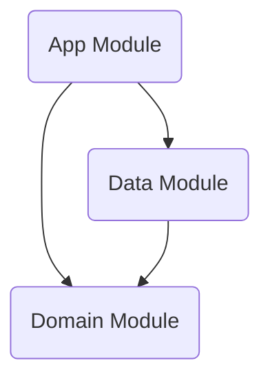

# 🏗️ MOS Project Architecture Documentation

**최종 업데이트**: 2026-02-13

---

## 🏛️ Architecture Overview

본 프로젝트는 **Clean Architecture** 원칙을 따르며, **MVVM (Model-View-ViewModel)** 패턴을 기반으로 3개의 모듈(Layer)로 구성되어 있습니다.

### 📊 Layer Dependency Graph

- **App**: UI 및 사용자 상호작용 담당 (Android Framework 의존, Presentation Layer 포함)
- **Domain**: 비즈니스 로직 및 핵심 모델 (순수 Kotlin, 외부 의존성 없음)
- **Data**: 데이터 소스 및 저장소 구현 (Repository Pattern)

---

## 🛠️ Module Detail

### 1. 📱 App Module (`:app`)
사용자에게 보여지는 UI와 상태 관리를 담당합니다. 이전에 분리되어 있던 Presentation 모듈이 통합되었습니다.

*   **UI Framework**: Jetpack Compose
*   **State Management**: ViewModel + StateFlow
*   **Dependency Injection**: Hilt
*   **Splash Screen**: `androidx.core:core-splashscreen` 사용
    *   `MainActivity` 실행 시 `installSplashScreen()` 호출
    *   `MainViewModel`의 데이터 로딩(`isReady`) 상태를 감지하여 스플래시 유지/해제 제어

#### 주요 컴포넌트
*   `MainActivity`: 앱 진입점, 스플래시 처리, DI 컨테이너 역할
*   `MainViewModel`: `SeoulUseCase`를 주입받아 비즈니스 로직 수행, UI 상태(`events`, `loadState`) 노출
*   `MainScreen`: `ViewModel`의 상태를 구독하여 화면 렌더링 (Stateless Composable 지향)

### 2. 🧠 Domain Module (`:domain`)
앱의 비즈니스 로직을 포함하며, 어떠한 안드로이드 의존성도 가지지 않습니다.

*   **Models**:
    *   `CulturalEvent` (Data Layer의 DTO와 분리된 순수 모델)
    *   `Subscription` (YouTube 구독 정보)
    *   `PlayList` (YouTube 재생목록 정보)
    *   `PlayItem` (YouTube 재생목록 아이템 정보)
*   **Repository Interfaces**:
    *   `SeoulRepository` (서울 문화행사 API 규약)
    *   `GoogleRepository` (Google/YouTube API 규약 — `getSubscriptions`, `getPlaylist`, `getContentDetail`)
*   **UseCase**: `SeoulUseCase`
    *   `SeoulRepository`를 주입받아 데이터 요청
    *   `withContext(Dispatchers.IO)`를 사용하여 **Worker Thread**에서 안전하게 실행 보장

### 3. 💾 Data Module (`:data`)
데이터 소스(API, DB)와의 통신 및 데이터 매핑을 담당합니다.

*   **Repository Implementation**: 
    *   `SeoulRepositoryImpl`: `SeoulRepository` 인터페이스 구현, `SeoulApi` 사용
    *   `GoogleRepositoryImpl`: `GoogleRepository` 인터페이스 구현, `GoogleApi` 사용
        *   Data → Domain 모델 매핑 함수 포함 (`toDomain()`)
*   **Data Sources**:
    *   **Remote**:
        *   `SeoulApi` (Ktor + Kotlinx Serialization) — 서울 문화행사 API
        *   `GoogleApi` (Retrofit + Gson) — YouTube Data API v3
            *   구독 목록, 재생목록, 재생목록 아이템 엔드포인트
    *   **Local**:
        *   `Room Database` (AppDatabase) — `CulturalEventDao`, `CulturalEventEntity`를 통한 로컬 캐싱
        *   `Preference` (DataStore Preferences) — Google 액세스 토큰 영속 관리
*   **Network / Auth**:
    *   `GoogleAuthInterceptor` (OkHttp Interceptor): DataStore에서 액세스 토큰을 읽어 Bearer 헤더 자동 첨부
*   **DI Modules**: 
    *   `DataModule` / `NetworkModule`: Network 클라이언트, Retrofit Builder, Repository 바인딩
    *   `DatabaseModule`: Room DB 및 DAO 제공
    *   `AppModule`: API 키 등 Android Context 기반 의존성 제공

---

### 1. Room 기반 로컬 캐싱 도입
*   `Room` 라이브러리를 사용하여 오프라인 대응 및 네트워크 비용 절감을 위한 로컬 저장소 구축
*   `Cache-then-Network` 전략을 `SeoulRepositoryImpl`에 적용하여 끊김 없는 사용자 경험 제공

### 2. 네트워크 직렬화 도구 교체 (Migration)
*   `Gson`에서 Kotlin 멀티플랫폼 및 성능에 최적화된 `Kotlinx Serialization`으로 전면 전환
*   JSON 파싱의 안정성을 높이기 위해 `ignoreUnknownKeys = true` 등의 설정 적용

### 3. 의존성 주입(DI) 고도화
*   `SeoulApi`에 직접적인 API 키 노출을 막기 위해 Hilt의 `@Named` 지시어와 주입 방식을 사용하여 보안성 및 유연성 확보
*   `DatabaseModule` 분리를 통해 데이터베이스 관련 의존성 관리 최적화
