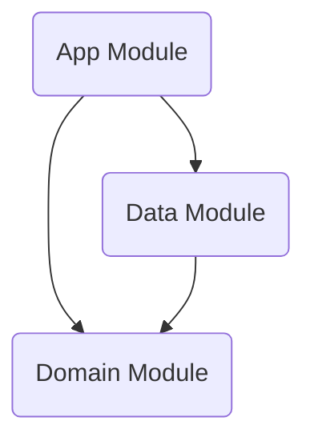
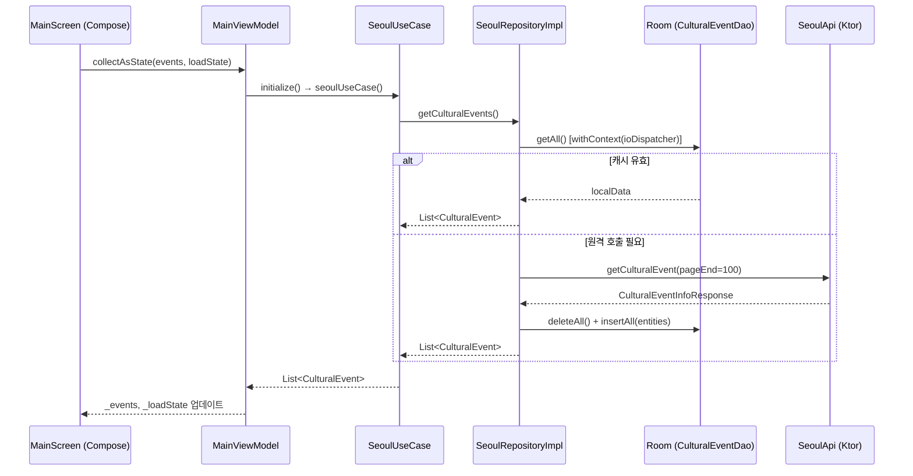

# 🏗️ MOS Project Architecture Documentation

**최종 업데이트**: 2026-03-17

---

## 1. 🏛️ Architecture Overview
본 애플리케이션(MOS)은 **Clean Architecture** 원칙을 엄격하게 준수하며 **MVVM (Model-View-ViewModel)** 패턴을 기반으로 한 안드로이드 최신 기술 스택으로 작성되었습니다.

### 1-1. 프로젝트 설정 명세
*   **언어**: Kotlin (Java 17 호환성 타겟팅)
*   **안드로이드 SDK 버전**:
    *   Minimum SDK: 27
    *   Target SDK: 36
    *   Compile SDK: 36
*   **기본 의존성 관리**: Gradle Kotlin DSL (`build.gradle.kts`)
*   **플러그인 환경**: KSP(Kotlin Symbol Processing) 적용

### 1-2. 📊 Layer Dependency Graph (모듈간 의존성)
프로젝트는 3개의 독립된 모듈(Layer) 단위로 분리되어 있습니다.



- **App (`:app`)**: 안드로이드 프레임워크(UI, Lifecycle 등)에 전적으로 의존하는 Presentation Layer입니다.
- **Data (`:data`)**: Remote(API) 및 Local(DB, DataStore) 소스와 통신하는 인프라 Layer입니다. Domain 모듈을 의존합니다.
- **Domain (`:domain`)**: 순수 Kotlin으로 작성된 핵심 비즈니스 로직과 Data 모델을 정의하며 외부 모듈(Data, App)이나 Android 프레임워크를 전혀 의존하지 않습니다.

---

## 2. 🛠️ Module Detail

### 2-1. 📱 App Module (`:app`)
사용자 UI 및 뷰 상태(UI State)와 상호작용 로직을 담당합니다.

*   **UI Framework**: Jetpack Compose (100% 컴포즈 적용)
*   **의존성 주입**: Hilt (앱 전역 초기화: `MosApplication`에서 `@HiltAndroidApp` 적용)

#### 주요 클래스 구현 세부사항

**1) `MosApplication` (앱 진입점)**
*   `@HiltAndroidApp`으로 Hilt DI 컨테이너를 초기화합니다.
*   전역 로그 태그 `"MOS"`를 `TAG` 상수로 노출합니다.

**2) `MainActivity` (화면 진입점)**
*   `installSplashScreen()`(`androidx.core`)를 호출하여 스플래시 화면 초기화.
*   `viewModel.isReady` StateFlow 값을 관찰하여 비동기 데이터 처리가 끝날 때까지 스플래시(`setKeepOnScreenCondition`) 유지.
*   `onBackPressedDispatcher.addCallback`를 등록하여 뒤로가기 액션 시 `finish()` 호출.
*   `setContent` 내부에서 `MosTheme`과 `Surface`를 씌워 `MainScreen`을 렌더링합니다.
*   `onStart`, `onResume`, `onPause`, `onDestroy` 각 라이프사이클 콜백에서 `MosApplication.TAG`를 통한 Logcat 로그를 출력합니다.

**3) `MainViewModel` (상태 관리)**
*   `@HiltViewModel` 주입, `SeoulUseCase`를 의존성으로 받습니다.
*   내부 속성 (전부 `MutableStateFlow`로 관리, `asStateFlow()`로 외부 노출):
    *   `_isReady` / `isReady` (Boolean): 스플래시 완료 여부 판단용 (초기값 `false`).
    *   `_events` / `events` (`List<CulturalEvent>`): 최종적으로 화면에 뿌려질 이벤트 데이터 (초기값 `emptyList()`).
    *   `_loadState` / `loadState` (String): UI 메시지 상태 (초기값 `"Loading"`).
*   `initialize()` 메서드 로직:
    *   `_isReady.value == true`인 경우 즉시 반환 (중복 호출 방지).
    *   `viewModelScope.launch` 내에서 데이터(`seoulUseCase()`) 요청 수행.
    *   정상 응답 시 `_events`에 데이터를 채우고 상태를 `"Complete"`로 변경.
    *   try-catch로 통신 에러 발생 시 `e.localizedMessage ?: "Error"` 값으로 상태 변경.
    *   성공/실패 여부에 상관없이 `finally` 블록에서 `_isReady.value = true`로 만들어 스플래시를 종료.

**4) `ui/MainScreen.kt` (UI 컴포넌트)**
*   `MainScreen`: ViewModel을 파라미터로 받아 `events`와 `loadState`를 `collectAsState()`로 수집하고, `MainScreenContent`에 전달합니다.
*   `MainScreenContent`: 실제 UI를 구성하는 Stateless 컴포저블. Preview 분리 가능한 구조.
    *   `loadState == "Loading"` 인 경우 중앙에 `CircularProgressIndicator()` 표시.
    *   그 외의 경우 `LazyColumn`으로 이벤트 리스트를 스크롤 가능한 형태로 표시 (제목 + 구분선).
*   `@Preview` 어노테이션으로 `MainScreenPreview`가 제공되어 스튜디오 내 미리보기 가능.

---

### 2-2. 🧠 Domain Module (`:domain`)
자바 라이브러리 플러그인(`java-library`)과 코틀린 표준 라이브러리(`kotlinStdlib`), Coroutines 코어, `javax.inject`만 가진 독립된 환경입니다. **Android 프레임워크 의존성 없음.**

#### 핵심 요소

**1) Models** (순수 비즈니스 데이터 모델, DTO 아님)
*   `CulturalEvent` (seoul): `title`, `date`, `place`, `mainImage`, `orgName`, `useFee` 필드를 가진 문화 행사 정보 모델.
*   `Subscription` (google): 유튜브 채널 구독 정보.
*   `PlayList` (google): 유튜브 재생목록 정보.
*   `PlayItem` (google): 유튜브 재생목록 아이템 정보.

**2) Repositories (Interfaces)**
*   `SeoulRepository`: `suspend fun getCulturalEvents(forceRefresh: Boolean = false): List<CulturalEvent>` 규약 정의.
*   `GoogleRepository`: `getSubscriptions()`, `getPlaylist(channelId)`, `getContentDetail(itemId)` 규약 정의.

**3) UseCase (`SeoulUseCase`)**
*   `@Inject constructor`로 `SeoulRepository`를 주입받습니다.
*   `suspend operator fun invoke()` 시 `repository.getCulturalEvents()`를 직접 호출합니다.
*   ⚠️ **스레드 전환 책임은 Repository(Data 계층)에 위임됩니다.** UseCase 자체는 `withContext`를 포함하지 않습니다.

---

### 2-3. 💾 Data Module (`:data`)
안드로이드 라이브러리 의존성과 서버 통신 인프라(Ktor, Retrofit, Room, DataStore)를 포함합니다.

#### 핵심 인프라 스트럭쳐 및 적용 기술
*   **Network Client (Android CIO + Ktor)**:
    *   `Network.getClient()` 구현체: `HttpClient(CIO)` 기반.
    *   통신 로깅: Ktor `Logging` 플러그인 (LogLevel.ALL, Android `Log.d` 연동).
    *   응답 Content 협상: `ContentNegotiation` 플러그인 (`kotlinx.serialization.json` 적용).
    *   JSON 설정: `ignoreUnknownKeys = true`, `isLenient = true`, `encodeDefaults = true`, `prettyPrint = true`.
*   **Network Client (OkHttp + Retrofit)** (Google API 전용):
    *   `OkHttpClient`에 `HttpLoggingInterceptor` (Level.BODY) 적용.
    *   `GoogleAuthInterceptor`를 별도 OkHttpClient에 추가하여 Google API 전용으로 사용.
*   **Room Database (`AppDatabase`)**:
    *   버전 제어를 따르는 오프라인 데이터 로컬 캐싱 DB (`mos_database`).
    *   Entity: `CulturalEventEntity` (`title`을 PrimaryKey로 사용, `createdAt` 타임스탬프 필드 포함).
    *   DAO: `CulturalEventDao` (`getAll`, `insertAll`, `deleteAll`).
*   **DataStore Preferences (`Preference`)**:
    *   `@Singleton` / `@Inject constructor`로 Hilt 주입.
    *   `@param:ApplicationContext` 어노테이션으로 Context 주입.
    *   Google Access Token 영속 관리 (`"mos_preferences"` 저장소).
    *   메서드: `saveGoogleAccessToken(token)`, `getGoogleAccessToken(): String?`, `clearGoogleAccessToken()`.

#### 코루틴 디스패처 DI 관리

*   **`CoroutineQualifiers.kt`**: Data 모듈 내부 전용 Qualifier 어노테이션 정의.
    *   `@IoDispatcher`: IO 작업용 `CoroutineDispatcher` 식별자.
    *   `@DefaultDispatcher`: CPU 집약적 작업용 `CoroutineDispatcher` 식별자.
*   **`DispatchersModule.kt`**: `@SingletonComponent`에 설치. Hilt로 `CoroutineDispatcher` 인스턴스 제공.
    *   `@IoDispatcher` → `Dispatchers.IO`
    *   `@DefaultDispatcher` → `Dispatchers.Default`

> 💡 **설계 의도**: Domain 모듈에서 Qualifier를 정의하지 않고 Data 모듈 내부에서 자체적으로 Qualifier를 소유함으로써, Domain → Data 역방향 의존성을 방지합니다.

#### 데이터 및 API 구조 구성

**1) Seoul API (Ktor / Kotlinx.Serialization)**
*   Remote Client: `SeoulApi` 클래스 (`@Inject constructor`로 `HttpClient`와 API Key 주입).
*   Endpoint: `http://openapi.seoul.go.kr:8088/{key}/json/culturalEventInfo/{pageStart}/{pageEnd}`
*   보안: API KEY (`seoul_key`)는 외부 private properties 파일(`~/Documents/private/key/app_props.properties`)에서 빌드 시 `resValue`로 주입. `AppModule`에서 `@Named("seoul_key")` Qualifier로 제공.
*   응답 파싱: `kotlinx.serialization` 기반 (`CulturalEventInfoResponse` → `CulturalEventInfo` → `CulturalEvent` 리스트).

**2) Google YouTube API (Retrofit / Gson)**
*   Remote Client Interface: `GoogleApi` (`https://www.googleapis.com/` 기반).
    *   `getSubscriptionList()`: `YoutubeResponse<Subscription>`
    *   `getPlayList(channelId)`: `YoutubeResponse<Playlist>`
    *   `getPlayItem(itemId)`: `YoutubeResponse<PlaylistItem>`
*   응답 파싱: `GsonConverterFactory` 채택 (`YoutubeResponse`, `Playlist`, `Subscription`, `PlaylistItem` 등).
*   인증: `GoogleAuthInterceptor`가 OkHttp 인터셉터로 동작. `runBlocking`으로 DataStore에서 토큰을 읽어 `Authorization: Bearer {token}` 헤더를 자동 추가 (토큰 없으면 헤더 미추가).
*   보안: Google 인증 키(`server_client_id`)도 동일한 private properties 파일에서 `resValue`로 주입.

#### Repository Implementations (`*Impl`)

**`SeoulRepositoryImpl` (Cache-then-Network 전략)**
*   `@Inject constructor`로 `SeoulApi`, `CulturalEventDao`, `@IoDispatcher CoroutineDispatcher` 주입.
*   `getCulturalEvents()` 전체를 `withContext(ioDispatcher)` 블록으로 래핑하여 IO 스레드에서 안전하게 실행.
*   내부적으로 `isSessionCacheValid` Bool 플래그(메모리 수준)로 세션 당 원격 호출 여부 관리.

`getCulturalEvents(forceRefresh)` 동작 로직:
1.  `localData = culturalEventDao.getAll()` 로컬 데이터 우선 조회.
2.  `shouldFetchRemote = forceRefresh || localData.isEmpty() || !isSessionCacheValid` 조건 계산.
3.  **False (캐시 사용)**: `localData`를 `toDomain()` 매핑 후 즉각 반환.
4.  **True (원격 호출)**: `getCulturalEventFromRemote(pageEnd = 100)` 호출 (page=1~100):
    *   응답을 `CulturalEventEntity` 리스트로 변환.
    *   `deleteAll()` 후 `insertAll()`로 캐시 갱신.
    *   `isSessionCacheValid = true` 세션 플래그 설정.
    *   `entities.map { it.toDomain() }` 반환.
5.  **에러 처리**: 통신 실패 시 `localData`가 있으면 Fallback 반환, 없으면 예외를 상위로 전파.
6.  내부 헬퍼 `CulturalEventEntity.toDomain()`: Entity → Domain 모델 변환.

**`GoogleRepositoryImpl` (Mapping 전담)**
*   `@Inject constructor`로 `GoogleApi` 주입.
*   `GoogleRepository` 인터페이스의 3가지 메서드 구현.
*   각 API 응답 DTO(`DataSubscription`, `Playlist`, `PlaylistItem`)를 Domain 모델로 변환하는 private `toDomain()` 확장 함수 보유.
*   IO 스레드 전환은 별도로 수행하지 않음 (필요 시 UseCase 또는 호출부에서 처리).

#### DI(Hilt) Modules 분리 기준
Data 모듈의 의존성 주입은 다음 구조로 모듈화(Hilt)되어 있습니다.

| 모듈 | 타입 | 역할 |
|---|---|---|
| `NetworkModule` | `@Module` / `object` | `HttpClient`(Ktor), `OkHttpClient`, `Retrofit.Builder`, `GoogleApi` 인스턴스 제공 |
| `DatabaseModule` | `@Module` / `object` | `AppDatabase` 및 `CulturalEventDao` 제공 |
| `RepositoryBindingModule` | `@Module` / `abstract class` | `SeoulRepositoryImpl` → `SeoulRepository`, `GoogleRepositoryImpl` → `GoogleRepository` 바인딩 |
| `AppModule` | `@Module` / `object` | `@Named("seoul_key")` API Key String 제공 (Context 리소스에서 읽음) |
| `DispatchersModule` | `@Module` / `object` | `@IoDispatcher`, `@DefaultDispatcher` `CoroutineDispatcher` 제공 |

> 📌 **주의**: `AppModule`은 패키지 상 `app.peter.mos.data.di`에 위치하지만, App 모듈 컨텍스트(Context)에 의존하는 리소스를 읽기 위해 `@ApplicationContext`를 활용합니다.

---

## 3. 🔄 Data Flow (데이터 흐름)



---

## 4. 📦 패키지 구조

```
mos/
├── app/
│   └── src/main/java/app/peter/mos/
│       ├── MosApplication.kt          # @HiltAndroidApp
│       ├── MainActivity.kt            # @AndroidEntryPoint, SplashScreen
│       ├── MainViewModel.kt           # @HiltViewModel, StateFlow 상태 관리
│       └── ui/
│           ├── MainScreen.kt          # Composable UI (Stateful + Stateless 분리)
│           └── theme/                 # Color, Theme, Type
├── domain/
│   └── src/main/java/app/peter/mos/domain/
│       ├── model/
│       │   ├── seoul/CulturalEvent.kt
│       │   └── google/ (PlayItem, PlayList, Subscription)
│       ├── repository/
│       │   ├── SeoulRepository.kt     # interface
│       │   └── GoogleRepository.kt    # interface
│       └── usecase/
│           └── SeoulUseCase.kt        # invoke() → repository 위임
└── data/
    └── src/main/java/app/peter/mos/data/
        ├── di/
        │   ├── AppModule.kt           # seoul_key @Named 제공
        │   ├── CoroutineQualifiers.kt # @IoDispatcher, @DefaultDispatcher
        │   ├── DataModule.kt          # NetworkModule, RepositoryBindingModule, DatabaseModule
        │   └── DispatchersModule.kt   # CoroutineDispatcher Hilt 제공
        ├── repositories/
        │   ├── SeoulRepositoryImpl.kt # Cache-then-Network, @IoDispatcher 사용
        │   └── GoogleRepositoryImpl.kt # DTO → Domain 매핑
        ├── source/
        │   ├── local/
        │   │   ├── dao/CulturalEventDao.kt
        │   │   └── entity/CulturalEventEntity.kt
        │   ├── model/                 # Data 계층 DTO 모델
        │   │   ├── seoul/cultural/
        │   │   └── google/youtube/
        │   └── remote/
        │       ├── SeoulApi.kt        # Ktor 기반
        │       └── GoogleApi.kt       # Retrofit 기반
        └── tool/
            ├── db/AppDatabase.kt
            ├── network/
            │   ├── Network.kt         # HttpClient(CIO) 팩토리
            │   └── GoogleAuthInterceptor.kt
            └── preference/Preference.kt  # DataStore @Singleton
```
