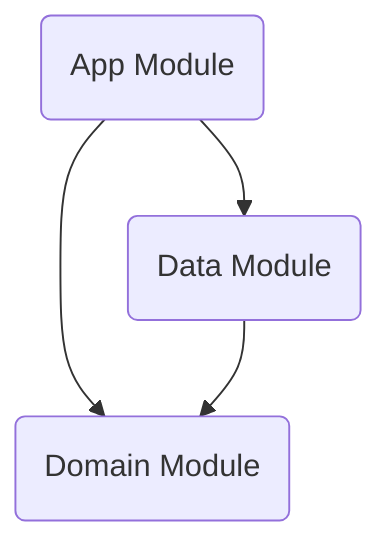
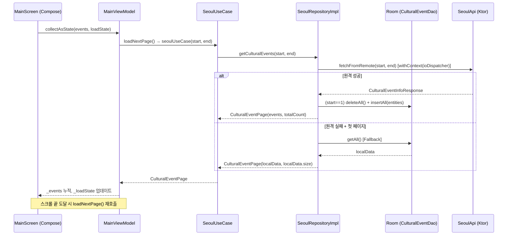
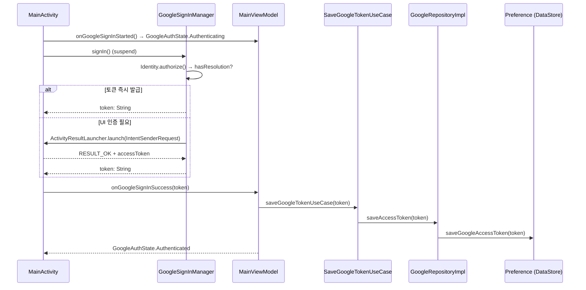

# 🏗️ MOS Project Architecture Documentation

**최종 업데이트**: 2026-03-31

---

## 1. 🏛️ Architecture Overview
본 애플리케이션(MOS)은 **Clean Architecture** 원칙을 엄격하게 준수하며 **MVVM (Model-View-ViewModel)** 패턴을 기반으로 한 안드로이드 최신 기술 스택으로 작성되었습니다.

### 1-1. 프로젝트 설정 명세
*   **언어**: Kotlin (Java 17 호환성 타겟팅)
*   **안드로이드 SDK 버전**:
    *   Minimum SDK: 27
    *   Target SDK: 36
    *   Compile SDK: 36
*   **기본 의존성 관리**: Gradle Kotlin DSL (`build.gradle.kts`)
*   **플러그인 환경**: KSP(Kotlin Symbol Processing) 적용

### 1-2. 📊 Layer Dependency Graph (모듈간 의존성)
프로젝트는 3개의 독립된 모듈(Layer) 단위로 분리되어 있습니다.



- **App (`:app`)**: 안드로이드 프레임워크(UI, Lifecycle 등)에 전적으로 의존하는 Presentation Layer입니다.
- **Data (`:data`)**: Remote(API) 및 Local(DB, DataStore) 소스와 통신하는 인프라 Layer입니다. Domain 모듈을 의존합니다.
- **Domain (`:domain`)**: 순수 Kotlin으로 작성된 핵심 비즈니스 로직과 Data 모델을 정의하며 외부 모듈(Data, App)이나 Android 프레임워크를 전혀 의존하지 않습니다.

---

## 2. 🛠️ Module Detail

### 2-1. 📱 App Module (`:app`)
사용자 UI 및 뷰 상태(UI State)와 상호작용 로직을 담당합니다.

*   **UI Framework**: Jetpack Compose (100% 컴포즈 적용)
*   **의존성 주입**: Hilt (앱 전역 초기화: `MosApplication`에서 `@HiltAndroidApp` 적용)

#### 주요 클래스 구현 세부사항

**1) `MosApplication` (앱 진입점)**
*   `@HiltAndroidApp`으로 Hilt DI 컨테이너를 초기화합니다.
*   전역 로그 태그 `"MOS"`를 `TAG` 상수로 노출합니다.

**2) `MainActivity` (화면 진입점)**
*   `installSplashScreen()`(`androidx.core`)를 호출하여 스플래시 화면 초기화.
*   `viewModel.isReady` StateFlow 값을 관찰하여 비동기 데이터 처리가 끝날 때까지 스플래시(`setKeepOnScreenCondition`) 유지.
*   `onBackPressedDispatcher.addCallback`를 등록하여 뒤로가기 액션 시 `finish()` 호출.
*   `setContent` 내부에서 `MosTheme`과 `Surface`를 씌워 `MainScreen`을 렌더링합니다.
*   `onStart`, `onResume`, `onPause`, `onDestroy` 각 라이프사이클 콜백에서 `MosApplication.TAG`를 통한 Logcat 로그를 출력합니다.
*   `GoogleSignInManager`를 생성하고 `register()`를 호출하여 OAuth 결과 수신 준비.
*   `onCreate()` 시 `startGoogleSignIn()`을 즉시 호출하여 앱 시작 시 Google 인증을 자동 시도합니다.
*   `observeGoogleAuthState()`로 인증 결과(성공/실패)를 Toast로 표시합니다.

**3) `GoogleSignInManager` (Google OAuth 처리)**
*   `ComponentActivity`를 생성자로 받으며, Hilt 주입 없이 Activity 수명주기 내에서 직접 생성합니다.
*   `register()`: `ActivityResultLauncher<IntentSenderRequest>`를 등록하여 OAuth 결과를 수신합니다.
*   `suspend fun signIn(): String`: `Google Identity SDK`의 `authorize()` API를 `suspendCancellableCoroutine`으로 래핑하여 코루틴 친화적으로 사용합니다.
    *   즉시 토큰이 있는 경우(재인증 불필요): 바로 resume
    *   `hasResolution() == true`인 경우: `IntentSenderRequest` 실행 후 Launcher 결과에서 토큰 추출
    *   토큰 없음 / 실패: `resumeWithException`으로 예외 전파
*   YouTube 읽기 전용 Scope(`youtube.readonly`)만 요청합니다.

**4) `LoadState` (UI 로딩 상태 모델)**
Sealed interface로 화면의 모든 데이터 로딩 상태를 표현합니다.
```kotlin
sealed interface LoadState {
    data object Idle        : LoadState
    data object Loading     : LoadState  // 첫 페이지 로딩
    data object LoadingMore : LoadState  // 추가 페이지 로딩 (무한스크롤)
    data object Success     : LoadState
    data class  Error(val message: String) : LoadState
}
```

**5) `GoogleAuthState` (Google 인증 상태 모델)**
Sealed interface로 Google OAuth 흐름의 모든 상태를 표현합니다.
```kotlin
sealed interface GoogleAuthState {
    data object Unauthenticated : GoogleAuthState
    data object Authenticating  : GoogleAuthState
    data object Authenticated   : GoogleAuthState
    data class  Error(val message: String) : GoogleAuthState
}
```

**6) `MainViewModel` (상태 관리)**
*   `@HiltViewModel` 주입, `SeoulUseCase`, `SaveGoogleTokenUseCase`, `ClearGoogleTokenUseCase`를 의존성으로 받습니다.
*   **StateFlow 목록** (전부 `MutableStateFlow`로 관리, `asStateFlow()`로 외부 노출):
    *   `_isReady` / `isReady` (Boolean): 스플래시 완료 여부 판단용 (초기값 `false`).
    *   `_events` / `events` (`List<CulturalEvent>`): 누적된 이벤트 목록 (초기값 `emptyList()`).
    *   `_loadState` / `loadState` (`LoadState`): 로딩 상태 (초기값 `LoadState.Idle`).
    *   `_googleAuthState` / `googleAuthState` (`GoogleAuthState`): Google 인증 상태 (초기값 `GoogleAuthState.Unauthenticated`).
*   **페이지네이션 상태 관리** (내부 변수):
    *   `totalCount`: API에서 반환된 전체 이벤트 수.
    *   `nextStart`: 다음 요청 시작 인덱스 (초기값 1).
    *   `isLoading`: 현재 요청 진행 여부 (중복 호출 방지).
    *   `PAGE_SIZE = 50`: 한 번에 가져오는 페이지 크기.
*   **주요 메서드**:
    *   `initialize()`: `events`가 비어있고 로딩 중이 아닐 때만 `loadNextPage()`를 호출합니다.
    *   `loadNextPage()`: 페이지 단위 로드. 첫 페이지면 `LoadState.Loading`, 이후 페이지면 `LoadState.LoadingMore`로 설정 후 데이터 요청.
    *   `refresh()`: 모든 상태를 초기화하고 첫 페이지부터 다시 로드합니다.
    *   `onGoogleSignInStarted()`: 인증 상태를 `Authenticating`으로 변경.
    *   `onGoogleSignInSuccess(token)`: `SaveGoogleTokenUseCase`를 호출하여 DataStore에 저장 후 `Authenticated`로 변경.
    *   `onGoogleSignInError(message)`: `Error` 상태로 변경.
    *   `signOut()`: `ClearGoogleTokenUseCase` 호출 후 `Unauthenticated`로 변경.

**7) `ui/MainScreen.kt` (UI 컴포넌트)**
*   `MainScreen`: ViewModel을 파라미터로 받아 `events`와 `loadState`를 `collectAsState()`로 수집하고, `MainScreenContent`에 전달합니다.
*   `MainScreenContent`: 실제 UI를 구성하는 Stateless 컴포저블.
    *   `LoadState.Loading`: 전체 화면 중앙 `CircularProgressIndicator()` 표시.
    *   `LoadState.Error`: 전체 화면 중앙 에러 메시지 텍스트 표시.
    *   그 외(`Idle`, `Success`, `LoadingMore`): `LazyColumn`으로 이벤트 리스트 표시.
        *   `rememberLazyListState` + `derivedStateOf`를 통해 리스트 하단 3개 항목 이내 진입 시 자동으로 `onLoadMore()` 호출 (무한스크롤).
        *   `LoadState.LoadingMore`인 경우 리스트 하단에 추가 `CircularProgressIndicator` 표시.
*   `@Preview` 어노테이션으로 `MainScreenPreview`가 제공되어 스튜디오 내 미리보기 가능.

---

### 2-2. 🧠 Domain Module (`:domain`)
자바 라이브러리 플러그인(`java-library`)과 코틀린 표준 라이브러리(`kotlinStdlib`), Coroutines 코어, `javax.inject`만 가진 독립된 환경입니다. **Android 프레임워크 의존성 없음.**

#### 핵심 요소

**1) Models** (순수 비즈니스 데이터 모델, DTO 아님)
*   `CulturalEvent` (seoul): API 응답의 모든 필드를 포함하는 문화 행사 정보 모델 (24개 필드).

    | 필드 | 설명 |
    |---|---|
    | `codeName` | 분류 |
    | `guName` | 자치구 |
    | `title` | 공연/행사명 |
    | `date` | 날짜 |
    | `place` | 장소 |
    | `orgName` | 기관명 |
    | `useTarget` | 이용대상 |
    | `useFee` | 이용요금 |
    | `inquiry` | 문의 |
    | `player` | 출연자정보 |
    | `program` | 프로그램소개 |
    | `etcDesc` | 기타내용 |
    | `orgLink` | 홈페이지 주소 |
    | `mainImage` | 대표이미지 URL |
    | `registrationDate` | 신청일 |
    | `ticket` | 시민/기관 |
    | `startDate` | 시작일 |
    | `endDate` | 종료일 |
    | `themeCode` | 테마분류 |
    | `lot` | 경도(Y좌표) |
    | `lat` | 위도(X좌표) |
    | `isFree` | 유무료 |
    | `homepageAddr` | 문화포털상세URL |
    | `proTime` | 행사시간 |

*   `CulturalEventPage` (seoul): 페이지네이션 응답 래퍼.
    *   `events: List<CulturalEvent>`: 현재 페이지 이벤트 목록.
    *   `totalCount: Int`: 서버의 전체 데이터 수.
*   `Subscription` (google): 유튜브 채널 구독 정보.
*   `PlayList` (google): 유튜브 재생목록 정보.
*   `PlayItem` (google): 유튜브 재생목록 아이템 정보.

**2) Repositories (Interfaces)**
*   `SeoulRepository`: `suspend fun getCulturalEvents(start: Int, end: Int): CulturalEventPage` 규약 정의.
*   `GoogleRepository`:
    *   `getSubscriptions()`, `getPlaylist(channelId)`, `getContentDetail(itemId)` 데이터 조회 규약 정의.
    *   `saveAccessToken(token)`, `clearAccessToken()` 토큰 영속 관리 규약 정의.

**3) UseCases**
*   `SeoulUseCase`: `invoke(start: Int, end: Int): CulturalEventPage` — Repository 위임.
*   `GetSubscriptionsUseCase`: `invoke(): List<Subscription>`
*   `GetPlaylistUseCase`: `invoke(channelId: String): List<PlayList>`
*   `GetContentDetailUseCase`: `invoke(itemId: String): PlayItem`
*   `SaveGoogleTokenUseCase`: `invoke(token: String)` — Access Token DataStore 저장.
*   `ClearGoogleTokenUseCase`: `invoke()` — Access Token DataStore 삭제.

> ⚠️ **스레드 전환 책임은 Repository(Data 계층)에 위임됩니다.** UseCase 자체는 `withContext`를 포함하지 않습니다.

---

### 2-3. 💾 Data Module (`:data`)
안드로이드 라이브러리 의존성과 서버 통신 인프라(Ktor, Retrofit, Room, DataStore)를 포함합니다.

#### 핵심 인프라 스트럭쳐 및 적용 기술
*   **Network Client (Android CIO + Ktor)**:
    *   `Network.getClient()` 구현체: `HttpClient(CIO)` 기반.
    *   통신 로깅: Ktor `Logging` 플러그인 (LogLevel.ALL, Android `Log.d` 연동).
    *   응답 Content 협상: `ContentNegotiation` 플러그인 (`kotlinx.serialization.json` 적용).
    *   JSON 설정: `ignoreUnknownKeys = true`, `isLenient = true`, `encodeDefaults = true`, `prettyPrint = true`.
*   **Network Client (OkHttp + Retrofit)** (Google API 전용):
    *   `OkHttpClient`에 `HttpLoggingInterceptor` (Level.BODY) 적용.
    *   `GoogleAuthInterceptor`를 별도 OkHttpClient에 추가하여 Google API 전용으로 사용.
*   **Room Database (`AppDatabase`)**:
    *   버전 제어를 따르는 오프라인 데이터 로컬 캐싱 DB (`mos_database`).
    *   Entity: `CulturalEventEntity` (`title`을 PrimaryKey로 사용, API 응답의 24개 필드 + `createdAt` 타임스탬프 포함).
    *   DAO: `CulturalEventDao` (`getAll`, `insertAll`, `deleteAll`).
*   **DataStore Preferences (`Preference`)**:
    *   `@Singleton` / `@Inject constructor`로 Hilt 주입.
    *   `@param:ApplicationContext` 어노테이션으로 Context 주입.
    *   Google Access Token 영속 관리 (`"mos_preferences"` 저장소).
    *   메서드: `saveGoogleAccessToken(token)`, `getGoogleAccessToken(): String?`, `clearGoogleAccessToken()`.

#### 코루틴 디스패처 DI 관리

*   **`CoroutineQualifiers.kt`**: Data 모듈 내부 전용 Qualifier 어노테이션 정의.
    *   `@IoDispatcher`: IO 작업용 `CoroutineDispatcher` 식별자.
    *   `@DefaultDispatcher`: CPU 집약적 작업용 `CoroutineDispatcher` 식별자.
*   **`DispatchersModule.kt`**: `@SingletonComponent`에 설치. Hilt로 `CoroutineDispatcher` 인스턴스 제공.
    *   `@IoDispatcher` → `Dispatchers.IO`
    *   `@DefaultDispatcher` → `Dispatchers.Default`

> 💡 **설계 의도**: Domain 모듈에서 Qualifier를 정의하지 않고 Data 모듈 내부에서 자체적으로 Qualifier를 소유함으로써, Domain → Data 역방향 의존성을 방지합니다.

#### 데이터 및 API 구조 구성

**1) Seoul API (Ktor / Kotlinx.Serialization)**
*   Remote Client: `SeoulApi` 클래스 (`@Inject constructor`로 `HttpClient`와 API Key 주입).
*   Endpoint: `http://openapi.seoul.go.kr:8088/{key}/json/culturalEventInfo/{start}/{end}`
*   보안: API KEY (`seoul_key`)는 외부 private properties 파일(`~/Documents/private/key/app_props.properties`)에서 빌드 시 `resValue`로 주입. `AppModule`에서 `@Named("seoul_key")` Qualifier로 제공.
*   응답 파싱: `kotlinx.serialization` 기반 (`CulturalEventInfoResponse` → `CulturalEventInfo` → `CulturalEventInfoData` 리스트).
    *   `CulturalEventInfo.count`: `list_total_count` (전체 데이터 수, 페이지네이션에 활용).

**2) Google YouTube API (Retrofit / Gson)**
*   Remote Client Interface: `GoogleApi` (`https://www.googleapis.com/` 기반).
    *   `getSubscriptionList()`: `YoutubeResponse<Subscription>`
    *   `getPlayList(channelId)`: `YoutubeResponse<Playlist>`
    *   `getPlayItem(itemId)`: `YoutubeResponse<PlaylistItem>`
*   응답 파싱: `GsonConverterFactory` 채택 (`YoutubeResponse`, `Playlist`, `Subscription`, `PlaylistItem` 등).
*   인증: `GoogleAuthInterceptor`가 OkHttp 인터셉터로 동작. `runBlocking`으로 DataStore에서 토큰을 읽어 `Authorization: Bearer {token}` 헤더를 자동 추가 (토큰 없으면 헤더 미추가).
*   보안: Google 인증 키(`server_client_id`)도 동일한 private properties 파일에서 `resValue`로 주입.

#### Repository Implementations (`*Impl`)

**`SeoulRepositoryImpl` (Remote-First with Fallback 전략)**
*   `@Inject constructor`로 `SeoulApi`, `CulturalEventDao`, `@IoDispatcher CoroutineDispatcher` 주입.
*   `getCulturalEvents(start, end)` 전체를 `withContext(ioDispatcher)` 블록으로 래핑하여 IO 스레드에서 안전하게 실행.
*   세션 캐시 플래그 방식을 제거하고, **항상 원격 API를 먼저 호출**하는 단순한 전략을 채택합니다.

`getCulturalEvents(start, end)` 동작 로직:
1.  원격 API 호출: `fetchFromRemote(start, end)` 실행.
2.  응답을 `CulturalEventEntity` 리스트로 변환.
3.  `start == 1`인 경우(첫 페이지): `deleteAll()` 후 `insertAll()`로 로컬 캐시를 교체 갱신.
4.  `start > 1`인 경우(이후 페이지): `insertAll()`로 캐시에 추가.
5.  `CulturalEventPage(events, totalCount)` 반환.
6.  **에러 처리 (Fallback)**: 통신 실패 시 `start == 1`에 한해 로컬 캐시 데이터로 Fallback 반환. 캐시도 없으면 예외를 상위로 전파.

**`GoogleRepositoryImpl` (Mapping 전담)**
*   `@Inject constructor`로 `GoogleApi`, `Preference` 주입.
*   `GoogleRepository` 인터페이스의 5가지 메서드 구현 (조회 3개 + 토큰 저장/삭제 2개).
*   각 API 응답 DTO(`DataSubscription`, `Playlist`, `PlaylistItem`)를 Domain 모델로 변환하는 private `toDomain()` 확장 함수 보유.
*   `saveAccessToken` / `clearAccessToken`은 `Preference`에 위임합니다.

#### DI(Hilt) Modules 분리 기준
Data 모듈의 의존성 주입은 다음 구조로 모듈화(Hilt)되어 있습니다.

| 모듈 | 타입 | 역할 |
|---|---|---|
| `NetworkModule` | `@Module` / `object` | `HttpClient`(Ktor), `OkHttpClient`, `Retrofit.Builder`, `GoogleApi` 인스턴스 제공 |
| `DatabaseModule` | `@Module` / `object` | `AppDatabase` 및 `CulturalEventDao` 제공 |
| `RepositoryBindingModule` | `@Module` / `abstract class` | `SeoulRepositoryImpl` → `SeoulRepository`, `GoogleRepositoryImpl` → `GoogleRepository` 바인딩 |
| `AppModule` | `@Module` / `object` | `@Named("seoul_key")` API Key String 제공 (Context 리소스에서 읽음) |
| `DispatchersModule` | `@Module` / `object` | `@IoDispatcher`, `@DefaultDispatcher` `CoroutineDispatcher` 제공 |

> 📌 **주의**: `AppModule`은 패키지 상 `app.peter.mos.data.di`에 위치하지만, App 모듈 컨텍스트(Context)에 의존하는 리소스를 읽기 위해 `@ApplicationContext`를 활용합니다.

---

## 3. 🔄 Data Flow (데이터 흐름)

### 서울 문화행사 (페이지네이션)



### Google OAuth 인증 흐름



---

## 4. 📦 패키지 구조

```
mos/
├── app/
│   └── src/main/java/app/peter/mos/
│       ├── MosApplication.kt          # @HiltAndroidApp
│       ├── MainActivity.kt            # @AndroidEntryPoint, SplashScreen, Google 로그인 트리거
│       ├── MainViewModel.kt           # @HiltViewModel, 페이지네이션·인증 상태 관리
│       ├── LoadState.kt               # sealed interface (Idle/Loading/LoadingMore/Success/Error)
│       ├── GoogleAuthState.kt         # sealed interface (Unauthenticated/Authenticating/Authenticated/Error)
│       ├── auth/
│       │   └── GoogleSignInManager.kt # Google Identity SDK OAuth 래퍼
│       └── ui/
│           ├── MainScreen.kt          # Composable UI (무한스크롤 포함)
│           └── theme/                 # Color, Theme, Type
├── domain/
│   └── src/main/java/app/peter/mos/domain/
│       ├── model/
│       │   ├── seoul/
│       │   │   ├── CulturalEvent.kt   # 24개 필드 데이터 모델
│       │   │   └── CulturalEventPage.kt # 페이지네이션 래퍼 (events + totalCount)
│       │   └── google/ (PlayItem, PlayList, Subscription)
│       ├── repository/
│       │   ├── SeoulRepository.kt     # interface — getCulturalEvents(start, end)
│       │   └── GoogleRepository.kt    # interface — 조회 3개 + 토큰 관리 2개
│       └── usecase/
│           ├── SeoulUseCase.kt        # invoke(start, end) → repository 위임
│           └── GoogleUseCase.kt       # GetSubscriptionsUseCase, GetPlaylistUseCase,
│                                      # GetContentDetailUseCase, SaveGoogleTokenUseCase,
│                                      # ClearGoogleTokenUseCase
└── data/
    └── src/main/java/app/peter/mos/data/
        ├── di/
        │   ├── AppModule.kt           # seoul_key @Named 제공
        │   ├── CoroutineQualifiers.kt # @IoDispatcher, @DefaultDispatcher
        │   ├── DataModule.kt          # NetworkModule, RepositoryBindingModule, DatabaseModule
        │   └── DispatchersModule.kt   # CoroutineDispatcher Hilt 제공
        ├── repositories/
        │   ├── SeoulRepositoryImpl.kt # Remote-First + Fallback 전략, @IoDispatcher 사용
        │   └── GoogleRepositoryImpl.kt # DTO → Domain 매핑, Preference 토큰 관리 포함
        ├── source/
        │   ├── local/
        │   │   ├── Local.kt           # (미사용 — 활용 계획 미정)
        │   │   ├── dao/CulturalEventDao.kt
        │   │   └── entity/CulturalEventEntity.kt  # 24개 필드 + createdAt
        │   ├── model/                 # Data 계층 DTO 모델
        │   │   ├── seoul/cultural/    # CulturalEventInfoResponse, CulturalEventInfo, CulturalEventInfoData
        │   │   └── google/youtube/    # YoutubeResponse, Subscription, Playlist, PlaylistItem
        │   └── remote/
        │       ├── SeoulApi.kt        # Ktor 기반
        │       └── GoogleApi.kt       # Retrofit 기반
        └── tool/
            ├── db/AppDatabase.kt
            ├── network/
            │   ├── Network.kt         # HttpClient(CIO) 팩토리
            │   └── GoogleAuthInterceptor.kt  # runBlocking으로 DataStore 토큰 읽어 헤더 추가
            └── preference/Preference.kt     # DataStore @Singleton
```
