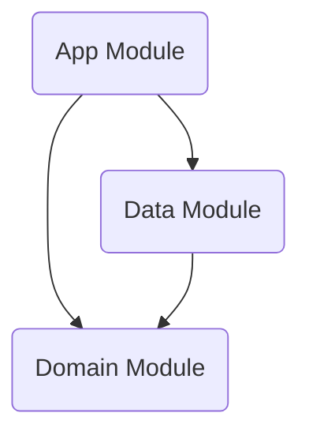

# 🏗️ MOS Project Architecture Documentation

**최종 업데이트**: 2026-03-14

---

## 1. 🏛️ Architecture Overview
본 애플리케이션(MOS)은 **Clean Architecture** 원칙을 엄격하게 준수하며 **MVVM (Model-View-ViewModel)** 패턴을 기반으로 한 안드로이드 최신 기술 스택으로 작성되었습니다.

### 1-1. 프로젝트 설정 명세
*   **언어**: Kotlin (Java 17 호환성 타겟팅)
*   **안드로이드 SDK 버전**:
    *   Minimum SDK: 27
    *   Target SDK: 36
    *   Compile SDK: 36
*   **기본 의존성 관리**: Gradle Kotlin DSL (`build.gradle.kts`)
*   **플러그인 환경**: KSP(Kotlin Symbol Processing) 적용

### 1-2. 📊 Layer Dependency Graph (모듈간 의존성)
프로젝트는 3개의 독립된 모듈(Layer) 단위로 분리되어 있습니다.

- **App (`:app`)**: 안드로이드 프레임워크(UI, Lifecycle 등)에 전적으로 의존하는 Presentation Layer입니다.
- **Data (`:data`)**: Remote(API) 및 Local(DB, DataStore) 소스와 통신하는 인프라 Layer입니다. Domain 모듈을 의존합니다.
- **Domain (`:domain`)**: 순수 Kotlin으로 작성된 핵심 비즈니스 로직과 Data 모델을 정의하며 외부 모듈(Data, App)이나 Android 프레임워크를 전혀 의존하지 않습니다.

---

## 2. 🛠️ Module Detail

### 2-1. 📱 App Module (`:app`)
사용자 UI 및 뷰 상태(UI State)와 상호작용 로직을 담당합니다. 과거의 Presentation 모듈이 통합된 형태입니다.

*   **UI Framework**: Jetpack Compose (100% 컴포즈 적용)
*   **의존성 주입**: Hilt (앱 전역 초기화: `MosApplication`에서 `@HiltAndroidApp` 적용)

#### 주요 클래스 구현 세부사항

**1) `MainActivity` (진입점)**
*   `installSplashScreen()`(`androidx.core`)를 호출하여 스플래시 화면 초기화.
*   `viewModel.isReady` StateFlow 값을 관찰하여 비동기 데이터 처리가 끝날 때까지 스플래시(`setKeepOnScreenCondition`) 유지.
*   `onBackPressedDispatcher`를 등록하여 뒤로가기 액션 시 `finish()` 호출.
*   `setContent` 내부에서 `MosTheme`과 `Surface`를 씌워 `MainScreen`을 렌더링합니다.

**2) `MainViewModel` (상태 관리)**
*   `@HiltViewModel` 주입, `SeoulUseCase`를 의존성으로 받습니다.
*   내부 속성 (전부 Flow로 관리):
    *   `_isReady` (Boolean): 스플래시 완료 여부 판단용.
    *   `_events` (`List<CulturalEvent>`): 최종적으로 화면에 뿌려질 이벤트 데이터.
    *   `_loadState` (String): `"Loading"`, `"Complete"`, `"Error"` 등의 UI 메시지 상태.
*   `initialize()` 메서드 로직:
    *   `viewModelScope.launch` 내에서 데이터(`seoulUseCase()`) 요청 수행.
    *   정상 응답 시 `_events`에 데이터를 채우고 상태를 `"Complete"`로 변경.
    *   try-catch로 통신 에러 발생 시 상태를 Error(Exception 메시지) 값으로 변경.
    *   성공/실패 여부에 상관없이 `finally` 블록에서 `_isReady` 값을 `true`로 만들어 스플래시를 종료시킵니다.

**3) `ui/MainScreen.kt` (UI 컴포넌트)**
*   `collectAsState()`를 사용하여 뷰모델의 상태 데이터(`events`, `loadState`) 관찰.
*   상태값에 따라 분기 렌더링 (`if (loadState == "Loading") CircularProgressIndicator()`)
*   `LazyColumn`을 통해 문화 행사 리스트를 스크롤 가능한 텍스트형 블록 UI로 뿌려줍니다 (`items(events)`). (뷰 분리자용 `------` 텍스트 사용)

---

### 2-2. 🧠 Domain Module (`:domain`)
자바 라이브러리 플러그인(`java-library`)과 코틀린 표준 라이브러리(`kotlinStdlib`), Coroutines 코어만 가진 독립된 환경입니다.

#### 핵심 요소

**1) Models** (순수 데이터 모델 클래스, DTO 아님)
*   `CulturalEvent`: 문화 행사 정보 (title, date, place, mainImage, orgName, useFee 등) 
*   `Subscription`, `PlayList`, `PlayItem`: 유튜브 채널 및 비디오 연관 비즈니스 모델.

**2) Repositories (Interfaces)**
*   `SeoulRepository`: `suspend fun getCulturalEvents(forceRefresh: Boolean = false): List<CulturalEvent>` 규약 정의.
*   `GoogleRepository`: 구독 리스트, 플레이리스트, 콘텐츠 디테일(`PlayItem`) 리턴 규약 정의.

**3) UseCase (`SeoulUseCase`)**
*   `operator fun invoke()` 시 `SeoulRepository.getCulturalEvents()`를 호출함.
*   `withContext(Dispatchers.IO)` 블록을 감싸서 메인/UI 스레드 블로킹을 차단하고 워커(IO) 스레드에서 안전하게 실행되도록 구조화됨.

---

### 2-3. 💾 Data Module (`:data`)
안드로이드 라이브러리 의존성과 서버 통신 인프라(Ktor, Retrofit, Room, DataStore)를 포함합니다. 

#### 핵심 인프라 스트럭쳐 및 적용 기술
*   **Network Client (Android CIo + Ktor & Retrofit)**:
    *   `Network.getClient()` 구현체: `HttpClient(CIO)` 기반이고, 통신 로깅을 위한 Ktor `Logging`(LogLevel.ALL), 응답 Content 협상을 위한 `ContentNegotiation`(kotlinx.serialization.json 적용)이 포함됩니다 (`ignoreUnknownKeys = true` 옵션 인가됨).
*   **Room Database (`AppDatabase`)**: 
    *   버전 제어를 따르는 오프라인 데이터 로컬 캐싱 DB (`mos_database`).
    *   Entity: `CulturalEventEntity`.
    *   DAO: `CulturalEventDao`(`getAll`, `insertAll`, `deleteAll`).
*   **DataStore Preferences (`Preference`)**: 
    *   Google Access Token 등의 영속적 인증 관리 (`"mos_preferences"` 이름 저장소 사용).

#### 데이터 및 API 구조 구성

**1) Seoul API (Ktor / Kotlinx.Serialization)**
*   Remote Client Interface: `SeoulApi`(`http://openapi.seoul.go.kr:8088/{key}/json/culturalEventInfo/..`)
*   보안: API KEY (`seoul_key`)는 `local.properties` (실제: `user.home/Documents/private/key/app_props.properties`)에서 빌드 시 주입되어 (`AppModule`에서 Hilt의 `@Named` Qualifier 적용) `SeoulApi` 객체 생성 시 넘겨받습니다.
*   데이터 파싱에는 멀티플랫폼 호환성이 높은 `Kotlinx Serialization`이 기본으로 지정됨.

**2) Google YouTube API (Retrofit / Gson)**
*   Remote Client Interface: `GoogleApi` (Base URL: `https://www.googleapis.com/`)
*   응답 모델(`YoutubeResponse`, `Playlist`, `Subscription` 등) 파싱은 `GsonConverter`를 채택.
*   인증: `OkHttpClient`에 `GoogleAuthInterceptor`를 부착해 DataStore 토큰을 읽어 Authorization 헤더를 자동으로 추가.

#### Repository Implementations (`*Impl`)

**`SeoulRepositoryImpl` (Cache-then-Network 전략)**
1.  이 Repository는 세션 당 한 번 강제 호출되었는지 확인용 `isSessionCacheValid` Bool 플래그 변수를 메모리 레벨에서 관리합니다.
2.  `getCulturalEvents()` 호출 로직:
    *   `localData` (Room DB 반환값)이 비어있는지 조사
    *   `shouldFetchRemote` = `forceRefresh` (명시적 갱신명령) OR `localData.isEmpty()` OR `!isSessionCacheValid`
3.  거짓(False)일 경우: 즉각 `localData`를 `toDomain()`으로 매핑 후 반환. (가장 빠른 응답)
4.  참(True)일 경우: Remote (`SeoulApi.getCulturalEvent`) 호출:
    *   응답 데이터를 `CulturalEventEntity` 리스트로 변환.
    *   `culturalEventDao.deleteAll()` 캐시 초기화 후 `.insertAll()` 최신 데이터 저장.
    *   세션 상태 유효성을 뜻하는 `isSessionCacheValid = true` 지정.
    *   DTO(`Entity`)를 비즈니스로 반환 (`.map { it.toDomain() }`).
5.  오류 처리 (Exception): 통신 실패 시(try-catch) 이전에 저장된 `localData`가 하나라도 있다면 이를 fallback(대체) 수단으로 리턴하고, 만일 완전 빈값이라면 에러 예외를 UI 단으로 던지는 완결성을 갖췄습니다.

**`GoogleRepositoryImpl` (Mapping 전문)**
*   Dto(ex. `DataSubscription`, `Playlist`, `PlaylistItem`)를 Domain Model로 파싱하는 보일러플레이트 코드(`toDomain()`)를 은닉하고 서비스 응답 리스트를 간결하게 매핑 반환합니다.

#### DI(Hilt) Modules 분리 기준
Data 모듈의 의존성 주입은 다음 구조로 모듈화(Hilt)되어 있습니다.
*   `NetworkModule`: `HttpClient`, `OkHttpClient`, Retrofit 빌더와 `GoogleApi` 인터페이스 생성.
*   `DatabaseModule`: `AppDatabase` Context 의존적 데이터베이스 및 안팎의 접근통로인 DAO Provide.
*   `RepositoryBindingModule`: 구현클래스(`Impl`)를 Domain의 추상화 인터페이스 타입으로 `@Binds`함.
*   `AppModule` (App Module Context 접근 영역): API Key String Value 제공.
