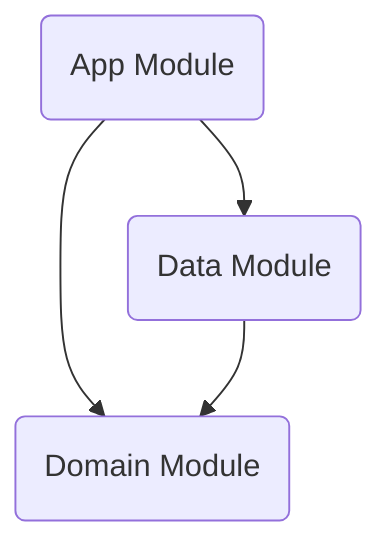

# 🏗️ MOS Project Architecture Documentation

**최종 업데이트**: 2026-02-03

---

## 🏛️ Architecture Overview

본 프로젝트는 **Clean Architecture** 원칙을 따르며, **MVVM (Model-View-ViewModel)** 패턴을 기반으로 3개의 모듈(Layer)로 구성되어 있습니다.

### 📊 Layer Dependency Graph

- **App**: UI 및 사용자 상호작용 담당 (Android Framework 의존, Presentation Layer 포함)
- **Domain**: 비즈니스 로직 및 핵심 모델 (순수 Kotlin, 외부 의존성 없음)
- **Data**: 데이터 소스 및 저장소 구현 (Repository Pattern)

---

## 🛠️ Module Detail

### 1. 📱 App Module (`:app`)
사용자에게 보여지는 UI와 상태 관리를 담당합니다. 이전에 분리되어 있던 Presentation 모듈이 통합되었습니다.

*   **UI Framework**: Jetpack Compose
*   **State Management**: ViewModel + StateFlow
*   **Dependency Injection**: Hilt
*   **Splash Screen**: `androidx.core:core-splashscreen` 사용
    *   `MainActivity` 실행 시 `installSplashScreen()` 호출
    *   `MainViewModel`의 데이터 로딩(`isReady`) 상태를 감지하여 스플래시 유지/해제 제어

#### 주요 컴포넌트
*   `MainActivity`: 앱 진입점, 스플래시 처리, DI 컨테이너 역할
*   `MainViewModel`: `SeoulUseCase`를 주입받아 비즈니스 로직 수행, UI 상태(`events`, `loadState`) 노출
*   `MainScreen`: `ViewModel`의 상태를 구독하여 화면 렌더링 (Stateless Composable 지향)

### 2. 🧠 Domain Module (`:domain`)
앱의 비즈니스 로직을 포함하며, 어떠한 안드로이드 의존성도 가지지 않습니다.

*   **Model**: `CulturalEvent` (Data Layer의 DTO와 분리된 순수 모델)
*   **Repository Interface**: `SeoulRepository` (Data Layer에서 구현할 규약 정의)
*   **UseCase**: `SeoulUseCase`
    *   `SeoulRepository`를 주입받아 데이터 요청
    *   `withContext(Dispatchers.IO)`를 사용하여 **Worker Thread**에서 안전하게 실행 보장

### 3. 💾 Data Module (`:data`)
데이터 소스(API, DB)와의 통신 및 데이터 매핑을 담당합니다.

*   **Repository Implementation**: 
    *   `SeoulRepositoryImpl`: `SeoulRepository` 인터페이스 구현, `SeoulApi` 사용
    *   `GoogleRepository`: (Placeholder) Google/YouTube API 연동 예정, 현재 빈 클래스
*   **Data Sources**:
    *   **Remote**: `SeoulApi` (Ktor/Network)
    *   **Local**: `Local`, `DataBase`, `Preference` (Placeholder) 로컬 데이터베이스 및 설정 저장소 예정
*   **DI Module**: `DataModule`
    *   `@Binds`를 사용하여 `SeoulRepositoryImpl`을 `SeoulRepository` 타입으로 바인딩

---

## 📝 Change Log (2026-02-03)

### 1. Splash Screen 구현
*   Android 12 대응 `core-splashscreen` 라이브러리 도입
*   앱 초기화(데이터 로딩)가 완료될 때까지 스플래시 화면을 유지하는 로직(`setKeepOnScreenCondition`) 추가

### 2. Clean Architecture Refactoring
*   **Domain Layer 강화**:
    *   기존 App 모듈에 혼재되어 있던 로직을 Domain 모듈로 이관
    *   `GetCulturalEventsUseCase` → `SeoulUseCase`로 리네이밍 및 역할 재정의
    *   `CulturalEventRepository` → `SeoulRepository` 인터페이스 정의
*   **Data Layer 분리**:
    *   `SeoulRepository` 클래스 → `SeoulRepositoryImpl`로 명칭 변경 및 인터페이스 구현체로 전환
*   **의존성 주입(DI) 개선**:
    *   ViewModel이 Repository 구체 클래스가 아닌, UseCase를 통해 데이터에 접근하도록 변경
    *   Hilt Module에서 Interface와 Implementation 바인딩 설정 추가

### 3. Threading Model 개선
*   ViewModelScope(`Main`)에서 안전하게 호출할 수 있도록, UseCase 내부에서 `Dispatchers.IO`로 컨텍스트 전환 로직 추가

### 4. Placeholder Classes 추가
*   향후 기능 확장을 위한 `GoogleRepository`, `Local`, `DataBase`, `Preference` 클래스 뼈대 추가 (구현 예정)
